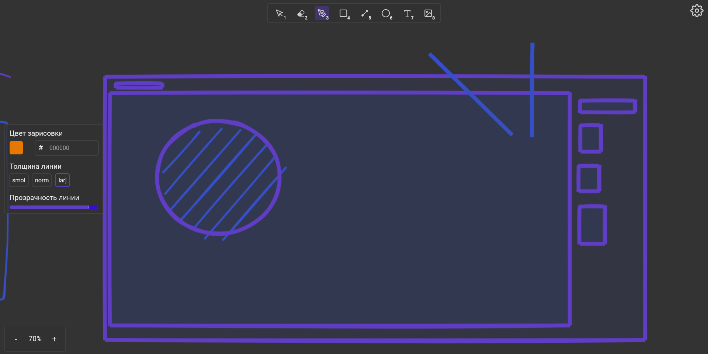

# DrawGa

## О проекте

DrawGa - это многопользовательская онлайн-доска для рисования, которая позволяет пользователям рисовать с другими пользователями в режиме реального времени.

## Функциональность

-   Многопользовательское рисование
-   Добавление комментариев
-   Система авторизации и регистрации пользователей

## Стэк технологий

### Front-end:

-   HTML
-   CSS
-   TypeScript
-   WebSockets

### Back-end:

-   C#
-   ASP.NET
-   SQLite

## Ссылка: https://draw.ga/Draw
